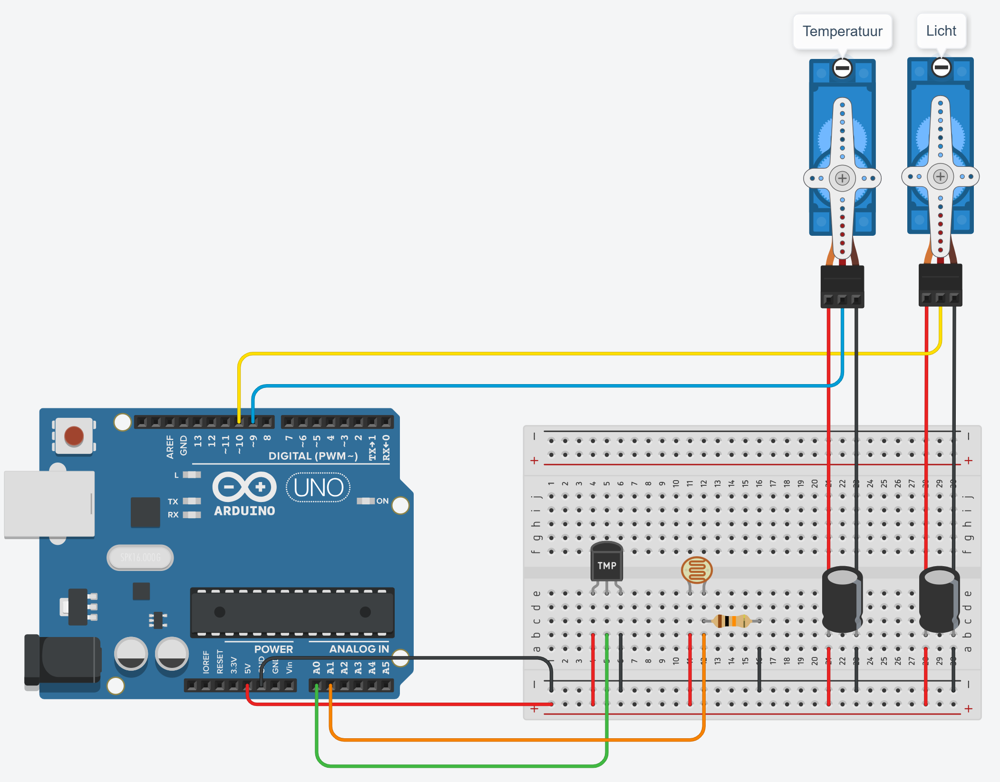

# Slaapomgevingsmonitor Mini

De Slaapongevingsmonitor Mini meet de temperatuur en de hoeveelheid licht in de slaapkamer. Afhankelijk daarvan toont hij een "duimpje omhoog" of een "duimpje omlaag". De linker duim geeft aan of de temperatuur goed is om te slapen, de rechter duim geeft aan of het donker genoeg is om te slapen.

## Fimpjes

Het maken van deze slaapomgevingsmonitor Mini wordt uitgelegd in de volgende filmpjes:

- [Filmpje 1: Introductie: het project]()
  - Hierin worden de basis beginselen uitgelegd van elektronica en de Arduino
- [Filmpje 2: Temperatuur meten]()
  - [Schema](documentation/electrical-diagram-step-1.png) 
  - [Programma](https://github.com/MartenSchukkinkROC/slaapomgevingsmonitor-mini/blob/step-1/slaapomgevingsmonitor-mini.ino)
- [Filmpje 3: Licht meten]()
  - [Schema](documentation/electrical-diagram-step-2.png)
  - [Programma](https://github.com/MartenSchukkinkROC/slaapomgevingsmonitor-mini/blob/step-2/slaapomgevingsmonitor-mini.ino)
- [Filmpje 4: Servo's gebruiken]()
  - [Schema](documentation/electrical-diagram-step-3.png)
  - [Programma](https://github.com/MartenSchukkinkROC/slaapomgevingsmonitor-mini/blob/main/slaapomgevingsmonitor-mini.ino)

## Gebruikte onderdelen

- Arduino Uno R3 (met USB-kabel)
- Breadboard
- TMP36 temperatuursensor
- Fotogevoelige weestand (Photoresistor, Light Dependent Resistor, LDR)
- Weerstand van 10 kΩ (bruin-zwart-oranje-goud)
- 2 Servo motoren
- 2 Condesatoren van 100 µF
- 2x3 Male header pins
- Jumper wires
- Stevig stuk karton of hout van ongeveer A4-formaat
- Template om uit te printen (zie hieronder)

## Elektrisch schema

Het elektrische schema van het eindresultaat ziet er als volgt uit:

## Template
Het template voor de figuur kun je [via deze pagina](documentation/template.pdf) downloaden. Klik op de pagina op de downloadlink om het in pdf-formaat te downloaden. Deze kun je uitprinten en op een stuk stevig karton of houten plaat plakken. De blauwe cirkels moeten geboord worden met een boor van 15mm. Hier komen straks de servo's in. De duimpjes moet je netjes uitknippen, deze worden op de armen van de servo's geplakt.

## Meer informatie over gebruikte componenten
Hieronder vindt je extra links voor dit project. Bijvoorbeeld van de verschillende componenten die worden gebruikt. Hier kun extra informatie vinden over de componenten. Misschien doe je wel leuke nieuwe ideeen op!

- Lichtsensor (photoresistor) - [How to Use Photoresistors to Detect Light on an Arduino](https://www.circuitbasics.com/how-to-use-photoresistors-to-detect-light-on-an-arduino/)
- Temperatuursensor (TMP36) - [Using A TMP36 Temperature Sensor With Arduino](https://bc-robotics.com/tutorials/using-a-tmp36-temperature-sensor-with-arduino/) 
- Servo's (SM-S2309S) - [Servo Motor Basics with Arduino](https://docs.arduino.cc/learn/electronics/servo-motors/) [Specs](https://descargas.cetronic.es/microservo.pdf)

## Slaapomgevingsmonitor

Een [uitgebreidere versie van de Slaapomgevingsmonitor](https://github.com/MartenSchukkinkROC/slaapomgevingsmonitor) vindt je ook op mijn GitHub. Deze versie checkt 4 verschillende dingen: licht, luchtvochtigheid, temperatuur en geluid (lawaai). Er zijn dan ook vier duimpjes die worden aangestuurd.

Het elektrische circuit van dit project is wat complexer, omdat een temperatuur- en vochtsensor is toegevoegd, een geluidssensor en 2 extra servo's. Daarnaast worden de servo's apart van voeding voorzien, wat beter is omdat de Arduino niet genoeg stroom kan leveren aan 4 servo's (eigenlijk is dit ook beter bij het gebruik van maar 2 servo's). 

De programmacode is ook wat complexer. Zo wordt het gemiddelde van een aantal metingen gebruikt om de servo's aan te sturen. Dit zorgt voor een betere aansturing van de duimpjes. Het bepalen van de hoeveelheid lawaai is ook een stuk complexer dan in dit project. Kun jij het allemaal begrijpen wat er in de code van dit project gebeurt?