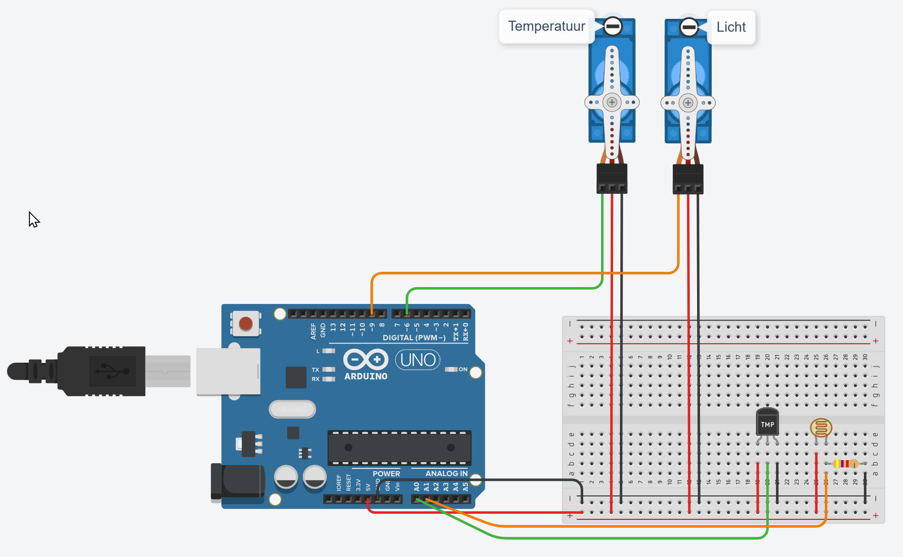

# Slaapomgevingsmonitor Mini

## Doel van het project

## Gebruikte componenten

Gebruikte componenten en links

- Arduino Uno (starter kit)
- Lichtsensor (photoresistor) - [How to Use a Photoresistor!](https://projecthub.arduino.cc/tropicalbean/how-to-use-a-photoresistor-1143fd)
- Temperatuursensor (TMP36) - [Using A TMP36 Temperature Sensor With Arduino](https://bc-robotics.com/tutorials/using-a-tmp36-temperature-sensor-with-arduino/) 
- Servo's (SM-S2309S) - [Servo Motor Basics with Arduino](https://docs.arduino.cc/learn/electronics/servo-motors/) [Specs](https://descargas.cetronic.es/microservo.pdf)
- Diverse weerstanden en condensatoren om de sensoren en actuatoren correct aan te sluiten

## Schema

